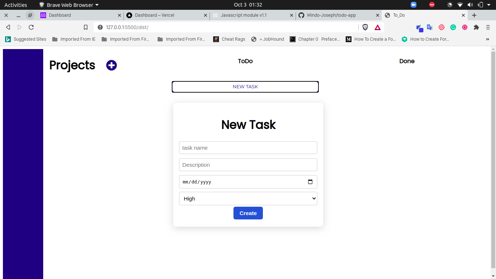
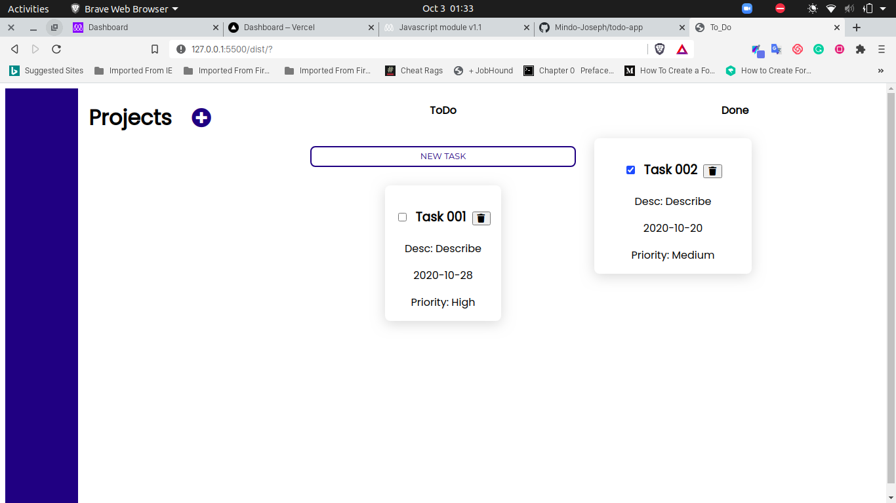

<br />
<p align="center">
  <a href="https://www.microverse.org/">
    
  </a>

  <h2 align="center">Project: To-Do List App </h2>

  <p align="center">
    This project is part of the Microverse curriculum in Javascript module!
  </p>
</p>

## About The Project

The main goal of this project is for the student to show the understanding of Single Responsibility and Tightly Coupled Objects.

## Screenshots




## Live Link
[To-Do](https://todo-app-tan.vercel.app/)

<!-- INSTALLATION -->
## Installation

* Clone this repo ```git clone https://github.com/Mindo-Joseph/todo-app.git```
* Open terminal```cd``` to the cloned folder
* Checkout to the feature branch by ```git checkout feature-todoList```
* Install dependencies by running ```npm i``` in your terminal
* Run webpack build by using the following command ```npm run build```
  


### Usage

Once you have installed dependencies and run webpack build command  open ```dist/index.html``` in your browser 


### Tests
To run tests open your terminal and run `npm run test`

### Built With

* Javascript
* Webpack
* Jest
## Author


👤 **Joseph Mindo**

- Github: [@MindoJoseph](https://github.com/Mindo-Joseph)
- Twitter: [@mindoJoseph](https://twitter.com/mindoJoseph)
- Linkedin: [Joseph Mindo](https://www.linkedin.com/in/josephmindo/)


## 🤝 Contributing

Contributions, issues and feature requests are welcome!

Feel free to check the [issues page](https://github.com/Mindo-Joseph/todo-app/issues).


## Acknowledgments

* [Microverse](https://www.microverse.org/)


## 📝 License

This project is [MIT](lic.url) licensed.


## Show your support

Give a ⭐️ if you like this project!